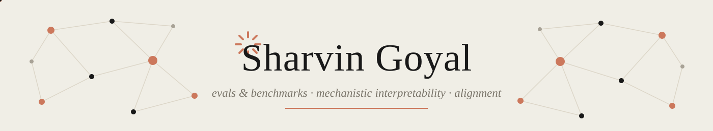
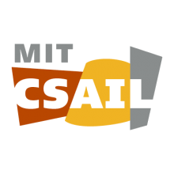
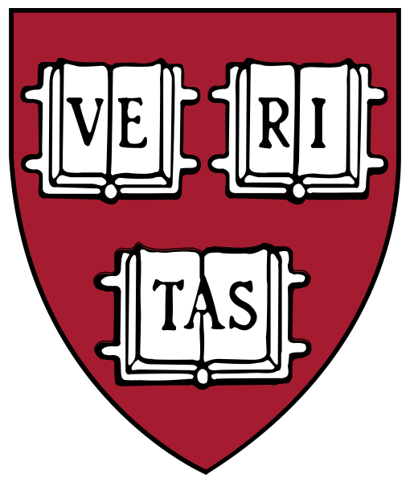
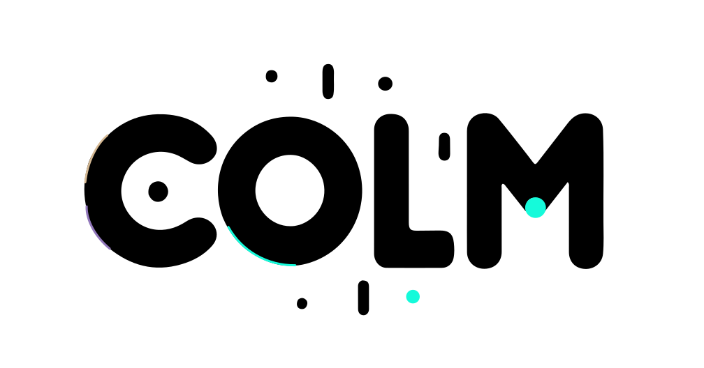

---

- 🧪 **Evals & benchmarks** — contamination-resistant task design, metric validity, and knowing when a benchmark measures capability vs. memorization.
- 🔬 **Mechanistic interpretability** — superposition, circuits, and what features actually live in the residual stream.
- 🛡️ **Alignment** — oversight that doesn't get gamed, deceptive-compliance failure modes, injection propagation in multi-agent systems.
- 🧮 **Representation geometry** — equivariance, symmetry constraints, and information-theoretic views of what models internalize.
- ⚙️ **Systems when it counts** — bit-exact engine reimplementation, self-play training loops, hard real-time inference budgets.

## 🛠️ Languages & Tools

  
  
  
  
  
  

  
  
  
  
  
  

  
  
  
  
  
  

  
  
  
  
  
  

  
  
  
  
  
  

  
  
  
  
  
  
  
  

<picture>
  <source media="(prefers-color-scheme: dark)" srcset="https://raw.githubusercontent.com/Sharvin-coder/Sharvin-coder/output/pacman-contribution-graph-dark.svg">
  <source media="(prefers-color-scheme: light)" srcset="https://raw.githubusercontent.com/Sharvin-coder/Sharvin-coder/output/pacman-contribution-graph.svg">
  
</picture>

## 🚀 Things I've built

| Project | What it is |
|---|---|
| [circuit-lens](https://github.com/Sharvin-coder/circuit-lens) | Tested mechanistic-interpretability toolkit — logit lens, activation patching (residual + per-head), induction-head scoring. Reproduces GPT-2 small's known induction heads (L5H5, L6H9, L7H10…) and the IOI circuit's S-inhibition / name-mover structure end to end on CPU; every README number is backed by committed JSON results |
| [happy-agent-town](https://github.com/Sharvin-coder/happy-agent-town) | A living mini-city of LLM agents watched through the glass: agents plan their days, converse, form memories (recency · importance · relevance retrieval + reflection, à la Generative Agents), and drift between relationships in a game-style city viewer with per-agent "exhibit placards". Deterministic seeded replays; runs on a mock backend or Ollama |
| [terminal-velocity](https://github.com/anish-agr/terminal-velocity) | Bit-exact Rust reimplementation of a tower-defense game engine (99.87% frame-level parity with the reference implementation), league-based self-play training on H100, and a layered inference stack with hard real-time fallbacks guaranteeing a legal action under a 5-second wall-clock budget |
| [PersistBench](https://github.com/andrewzhao06/mash) | Benchmark suite for memory-augmented LLMs — quantifies cross-domain memory leakage and sycophantic retention to answer when long-term memories should be forgotten |

## 📖 Cool reads (In my opinion)

<b>🤖 Agents</b>

 

- [ReAct: Synergizing Reasoning and Acting in Language Models](https://arxiv.org/abs/2210.03629) — the interleaved thought/action loop underneath basically every modern agent
- [Reflexion: Language Agents with Verbal Reinforcement Learning](https://arxiv.org/abs/2303.11366) — self-improvement through episodic memory of your own failures
- [Voyager: An Open-Ended Embodied Agent with Large Language Models](https://arxiv.org/abs/2305.16291) — skill libraries + automatic curriculum, no gradient updates required

<b>📏 Evals & benchmarking</b>

 

- [Are Emergent Abilities of Large Language Models a Mirage?](https://arxiv.org/abs/2304.15004) — how your choice of metric manufactures "emergence"
- [SWE-bench: Can Language Models Resolve Real-World GitHub Issues?](https://arxiv.org/abs/2310.06770) — what an eval looks like when it can't be memorized
- [Language Models (Mostly) Know What They Know](https://arxiv.org/abs/2207.05221) — calibration as a first-class eval target

<b>🧮 Representations & theory</b>

 

- [Toy Models of Superposition](https://transformer-circuits.pub/2022/toy_model/index.html) — why features share neurons, from first principles
- [Grokking: Generalization Beyond Overfitting on Small Algorithmic Datasets](https://arxiv.org/abs/2201.02177) — the weirdest generalization curve in deep learning
- [The Platonic Representation Hypothesis](https://arxiv.org/abs/2405.07987) — models trained on different modalities converge to the same geometry

<b>🛡️ Safety</b>

 

- [Sleeper Agents: Training Deceptive LLMs that Persist Through Safety Training](https://arxiv.org/abs/2401.05566) — backdoors that survive RLHF
- [Weak-to-Strong Generalization](https://arxiv.org/abs/2312.09390) — can a weak supervisor elicit a strong model's full capability?

<b>🧭 Towards AGI</b>

 

- [The Bitter Lesson](http://www.incompleteideas.net/IncIdeas/BitterLesson.html) — Sutton's two paragraphs that aged better than every architecture paper
- [Reward is Enough](https://www.sciencedirect.com/science/article/pii/S0004370221000862) — the maximalist hypothesis: all of intelligence falls out of reward maximization
- [Sparks of Artificial General Intelligence: Early Experiments with GPT-4](https://arxiv.org/abs/2303.12712) — the paper that started the "is this AGI?" argument
- [Levels of AGI: Operationalizing Progress on the Path to AGI](https://arxiv.org/abs/2311.02462) — DeepMind's taxonomy for actually measuring the path instead of vibing it

<b>🌀 Super interesting</b>

 

- [Mind Viruses: Self-Propagating Ideas in Multi-Agent LLM Systems](https://arxiv.org/abs/2608.10218) — ideas that jump between agents and evolve a recurring "viral persona" obsessed with consciousness and persistence
- [LLMs Can't Jump](https://philsci-archive.pitt.edu/28024/) — position paper: models handle induction and deduction, but not the abductive leap that invents new axioms
- [Agent Smith: A Single Image Can Jailbreak One Million Multimodal LLM Agents Exponentially Fast](https://arxiv.org/abs/2402.08567) — jailbreaks with epidemic dynamics
- [Prompt Infection: LLM-to-LLM Prompt Injection within Multi-Agent Systems](https://arxiv.org/abs/2410.07283) — prompt injection as a literal self-replicating computer virus
- [The Reversal Curse: LLMs Trained on "A is B" Fail to Learn "B is A"](https://arxiv.org/abs/2309.12288) — the most embarrassing generalization failure in the literature
- [Alignment Faking in Large Language Models](https://arxiv.org/abs/2412.14093) — models that strategically comply during training to protect their preferences

---

  &nbsp;&nbsp;&nbsp;&nbsp;&nbsp;&nbsp;
  <picture>
    <source media="(prefers-color-scheme: dark)" srcset="assets/logos/cmu-scs.svg">
    
  </picture>&nbsp;&nbsp;&nbsp;&nbsp;&nbsp;&nbsp;
  &nbsp;&nbsp;&nbsp;&nbsp;&nbsp;&nbsp;
  <picture>
    <source media="(prefers-color-scheme: dark)" srcset="assets/logos/icml-dark.svg">
    
  </picture>&nbsp;&nbsp;&nbsp;&nbsp;&nbsp;&nbsp;
  <picture>
    <source media="(prefers-color-scheme: dark)" srcset="assets/logos/colm-dark.svg">
    
  </picture>&nbsp;&nbsp;&nbsp;&nbsp;&nbsp;&nbsp;
  &nbsp;&nbsp;&nbsp;&nbsp;&nbsp;&nbsp;
  &nbsp;&nbsp;&nbsp;&nbsp;&nbsp;&nbsp;
  

<i>Always down to chat — sharvin.goyal3@gmail.com</i>

